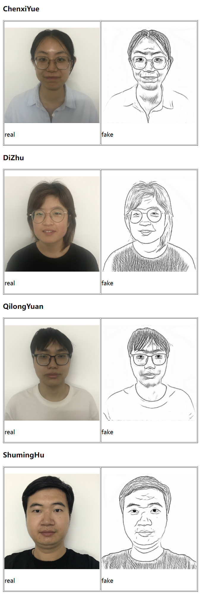
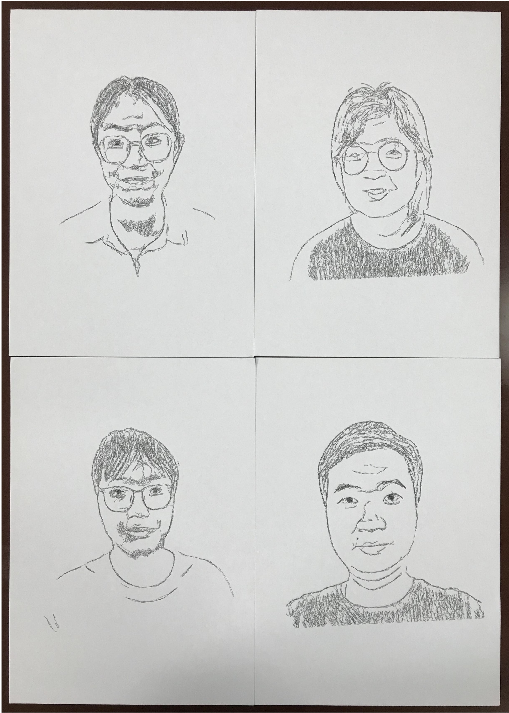

# Research Project Presentation Video

<video src="ICRA_video.mp4"></video>

# Our CycleGAN Result

Click on the following links to view the corresponding test results of the models trained with 7 styles of sketch images on the test avatar images, as shown in the following figure.

Style 1 result: [index.html](result_SKSF_test\results_SKSF_photo2sketch_1-face-test\SKSF_photo2sketch_1\test_latest\index.html) 

Style 2 result: [index.html](result_SKSF_test\results_SKSF_photo2sketch_2-face-test\SKSF_photo2sketch_2\test_latest\index.html) 

Style 3 result: [index.html](result_SKSF_test\results_SKSF_photo2sketch_3-face-test\SKSF_photo2sketch_3\test_latest\index.html) 

Style 4 result: [index.html](result_SKSF_test\results_SKSF_photo2sketch_4-face-test\SKSF_photo2sketch_4\test_latest\index.html) 

Style 5 result: [index.html](result_SKSF_test\results_SKSF_photo2sketch_5-face-test\SKSF_photo2sketch_5\test_latest\index.html) 

Style 6 result: [index.html](result_SKSF_test\results_SKSF_photo2sketch_6-face-test\SKSF_photo2sketch_6\test_latest\index.html) 

Style 7 result: [index.html](result_SKSF_test\results_SKSF_photo2sketch_7-face-test\SKSF_photo2sketch_7\test_latest\index.html) 

# Our Participates Experiment

We recruited four subjects and used iPhone7 Plus to take their headshots. The model was trained with 7 styles of sketch images for testing. Click on the following links to view the corresponding test results.

Style 1 result: [index.html](result_face_304_iphone\results_SKSF_photo2sketch_1-face-304\SKSF_photo2sketch_1\test_latest\index.html) 

Style 2 result: [index.html](result_face_304_iphone\results_SKSF_photo2sketch_2-face-304\SKSF_photo2sketch_2\test_latest\index.html) 

Style 3 result: [index.html](result_face_304_iphone\results_SKSF_photo2sketch_3-face-304\SKSF_photo2sketch_3\test_latest\index.html) 

Style 4 result: [index.html](result_face_304_iphone\results_SKSF_photo2sketch_4-face-304\SKSF_photo2sketch_4\test_latest\index.html) 

Style 5 result: [index.html](result_face_304_iphone\results_SKSF_photo2sketch_5-face-304\SKSF_photo2sketch_5\test_latest\index.html) 

Style 6 result: [index.html](result_face_304_iphone\results_SKSF_photo2sketch_6-face-304\SKSF_photo2sketch_6\test_latest\index.html) 

Style 7 result: [index.html](result_face_304_iphone\results_SKSF_photo2sketch_7-face-304\SKSF_photo2sketch_7\test_latest\index.html) 

In the actual test, the photos were taken with an iPhone 7 Plus. After the CycleGAN model stylized the photos, the best results were achieved with Styles 5, 6, and 7, followed by Styles 1 and 2, and the worst were Styles 3 and 4. The results of Style 5 are shown in the figure below:

We also used a drawing machine to draw on the stylized photos, and the final result is shown below

# Dataset

SKSF dataset address: https://github.com/kwanyun/SKSF-A

