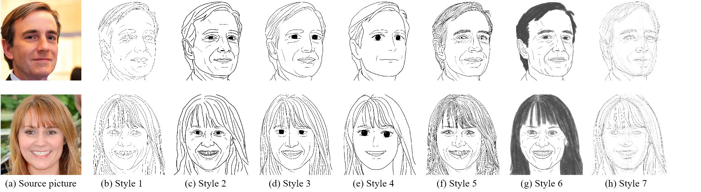

# Our Result

Click on the following links to view the corresponding test results of the models trained with 7 styles of sketch images on the test avatar images, as shown in the following figure.

分别点击以下链接，即可查看7种风格素描图片训练的模型在测试头像图片上的对应的测试结果，具体如下图所示。

Style 1 result: [index.html](results\results_SKSF_photo2sketch_1-face\SKSF_photo2sketch_1\test_latest\index.html) 

Style 2 result: [index.html](results\results_SKSF_photo2sketch_2-face\SKSF_photo2sketch_2\test_latest\index.html) 

Style 3 result: [index.html](results\results_SKSF_photo2sketch_3-face\SKSF_photo2sketch_3\test_latest\index.html) 

Style 4 result: [index.html](results\results_SKSF_photo2sketch_4-face\SKSF_photo2sketch_4\test_latest\index.html) 

Style 5 result: [index.html](results\results_SKSF_photo2sketch_5-face\SKSF_photo2sketch_5\test_latest\index.html) 

Style 6 result: [index.html](results\results_SKSF_photo2sketch_6-face\SKSF_photo2sketch_6\test_latest\index.html) 

Style 7 result: [index.html](results\results_SKSF_photo2sketch_7-face\SKSF_photo2sketch_7\test_latest\index.html) 

# Our Participates Experiment

我们招募了四名受试者，拍摄头像照片用的是 iPhone7 Plus手机，经过 7 种风格素描图片训练的模型进行测试，分别点击以下链接，对应的测试结果。

。

Style 1 result: [index.html](result_face_304_iphone\results_SKSF_photo2sketch_1-face-304\SKSF_photo2sketch_1\test_latest\index.html) 

Style 2 result: [index.html](result_face_304_iphone\results_SKSF_photo2sketch_2-face-304\SKSF_photo2sketch_2\test_latest\index.html) 

Style 3 result: [index.html](result_face_304_iphone\results_SKSF_photo2sketch_3-face-304\SKSF_photo2sketch_3\test_latest\index.html) 

Style 4 result: [index.html](result_face_304_iphone\results_SKSF_photo2sketch_4-face-304\SKSF_photo2sketch_4\test_latest\index.html) 

Style 5 result: [index.html](result_face_304_iphone\results_SKSF_photo2sketch_5-face-304\SKSF_photo2sketch_5\test_latest\index.html) 

Style 6 result: [index.html](result_face_304_iphone\results_SKSF_photo2sketch_6-face-304\SKSF_photo2sketch_6\test_latest\index.html) 

Style 7 result: [index.html](result_face_304_iphone\results_SKSF_photo2sketch_7-face-304\SKSF_photo2sketch_7\test_latest\index.html) 

实际测试，拍摄照片用的是 iPhone7 Plus，效果比较好的是 Style 5、6、7，其次是 Style 1、2，最差的是Style 3、4。Style 5 结果如下图所示：

In actual testing, the iPhone 7 Plus was used for taking photos, with Style 5, 6, and 7 showing better results, followed by Style 1 and 2, and Style 3 and 4 showing the worst results. The results of Style 5 are shown in the following figure:

# Dataset

SKSF dataset address: https://github.com/kwanyun/SKSF-A

